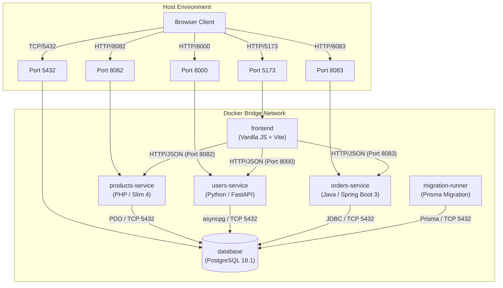

# System Map & Exploration — Module 1

## 1. System Diagram

---

## 2. Request Trace: `GET /products` (End-to-End)

Below is the complete trace of a single request (`GET /products`) from browser initialization to database query and DOM render:

1. **Frontend Initiation**:
   - `frontend/src/main.js:55` inside `init()` calls `renderProducts(config.productsApiUrl)` (where `config.productsApiUrl` resolves to `http://localhost:8082`).
   - `frontend/src/components/products.js:11` calls `fetchData('${apiUrl}/products')`.
   - `frontend/src/api/api.js:8` executes `fetch(url)` sending an HTTP GET request to `http://localhost:8082/products`.

2. **Network & Service Reception**:
   - Host receives request on port `8082` and forwards it to port `80` inside the `products-service` Docker container running PHP Apache / Slim 4.

3. **Backend Route Matching**:
   - `products-service/public/index.php:26` matches the route `$app->get('/products', function (Request $request, Response $response, $args) { ... })`.

4. **Database Query Execution**:
   - `products-service/public/index.php:41` executes `$stmt = $pdo->query("SELECT * FROM \"Product\"");` via PDO against PostgreSQL on container `database:5432`, querying table `"Product"`.

5. **Frontend DOM Rendering**:
   - `frontend/src/components/products.js:18-29` receives the returned JSON array of products and maps over each product to update `container.innerHTML` with card elements into `#products-container`.

---

## 3. Environment Gotchas

1. **PHP Vendor Mount Overwrite**:
   - *Issue*: When starting `products-service`, the Docker bind mount `./products-service:/var/www/html` overwrites the `/var/www/html/vendor` folder installed during image build, leading to `vendor/autoload.php` missing errors.
   - *Fix*: Execute `docker compose exec products-service composer install` after initial stack startup.

2. **Cross-Origin Resource Sharing (CORS)**:
   - *Issue*: The frontend (port 5173) makes cross-origin requests to services on ports 8082, 8000, and 8083.
   - *Fix*: CORS middleware MUST be configured in each microservice (e.g. Slim CORS middleware in `products-service/public/index.php:13-19`, FastAPI CORSMiddleware in `users-service`, and Spring CORS in `orders-service`).

3. **PostgreSQL Startup Synchronization**:
   - *Issue*: Dependent services (`orders-service` and `migration-runner`) fail if they attempt to connect before PostgreSQL initialization completes.
   - *Fix*: `docker-compose.yml` configures healthchecks (`pg_isready`) on the `database` service, with `depends_on: { database: { condition: service_healthy } }`.

---

## 4. Documentation Drift

> **Quote from `ARCHITECTURE.md` (lines 14 & 40):**
> `"Frontend Service (React + Vite)"`
> `"Tech Stack: React 19.2.0, Vite 7.2.4, Tailwind CSS 4.1.17"`

- **Reality**: The frontend is NOT built with React or Tailwind CSS. Commit `cb62cc6` refactored the frontend to pure Vanilla JavaScript + Vite 6.x (`frontend/package.json` has `"vite": "^7.2.4"` in devDependencies without any React or Tailwind packages). The documentation in `ARCHITECTURE.md` still incorrectly references React 19.2.0 and Tailwind CSS 4.1.17.
